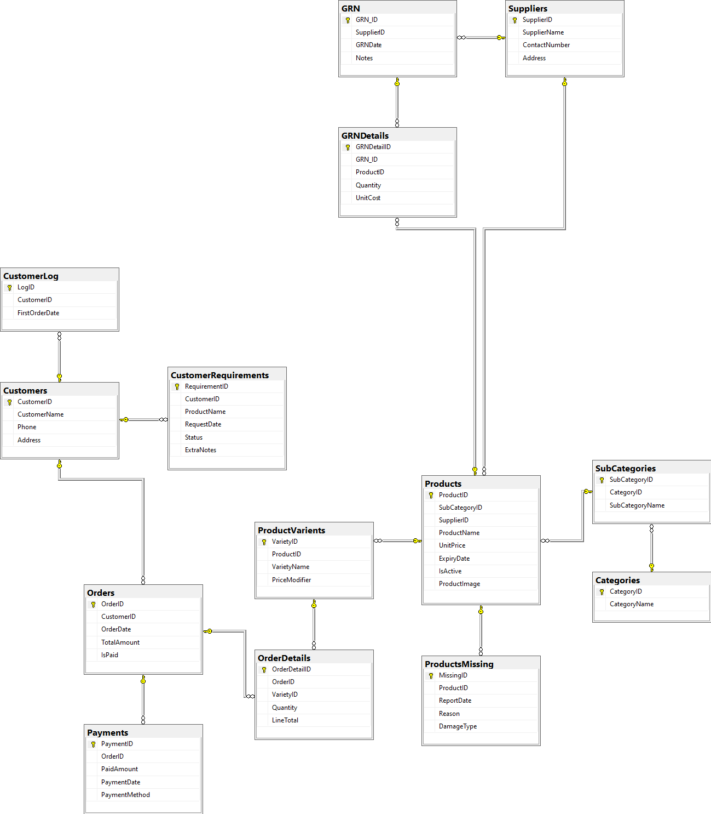

# Sweets & Bakery Store Management Database

## Project Overview
This repository contains the SQL scripts and architectural design for a relational database built to manage the core operations of a Sweets and Bakery business. The system handles end-to-end operational workflows, including inventory tracking (Goods Receipt Notes), supplier logistics, customer order management, and spoilage reporting.

Developed as Monthly Project 01 (Module 02) under the ISDB-BISEW IT Scholarship Programme (Submitted on: 14 September 2025), the primary focus of this project was to translate real-world business requirements into a scalable relational model using optimized T-SQL.

## Database Architecture (ER Diagram)
Below is the Entity-Relationship Diagram representing the fully normalized database schema:

## Technology Stack
* Database Engine: MS SQL Server
* Query Language: T-SQL (Transact-SQL)

## Key Architectural Implementations
To ensure data integrity, scalability, and performance, the following SQL features and best practices were implemented:

* Database Schema & Normalization: Designed a fully normalized relational model consisting of 14 tables. Enforced data consistency using Primary/Foreign Keys, UNIQUE constraints, and Sparse columns for optimized storage of null-heavy data.
* Business Logic Automation (Stored Procedures): Encapsulated transactional tasks into stored procedures (e.g., order insertion, payment processing, and low-stock alerts) to reduce network traffic and prevent SQL injection vulnerabilities.
* Event-Driven Logging (Triggers): Implemented AFTER INSERT triggers to automate customer history tracking independently of the application layer.
* Reusable Reporting Logic (UDFs): Developed Scalar and Multi-Statement Table-Valued Functions (TVFs) to generate instant metrics, such as customer payment summaries and order frequencies.
* Data Abstraction (Views): Created views (including WITH SCHEMABINDING for performance) to provide secure, simplified access to complex datasets like active inventory and damaged product logs.
* Advanced Data Analysis: Leveraged advanced T-SQL querying techniques for complex reporting:
  * Window Functions (OVER, AVG, MAX) for analytical calculations.
  * GROUP BY with ROLLUP for generating subtotal and grand total reports.
  * Pagination using OFFSET...FETCH for managing large result sets efficiently.
  * Implementation of complex Joins, Subqueries, and CASE statements.

## Project Outcome
This project demonstrates a practical understanding of database administration and development. It showcases the ability to design an optimized database schema that can handle varied product pricing, track supplier shipments, manage customer credit, and provide actionable business insights through complex SQL queries.
